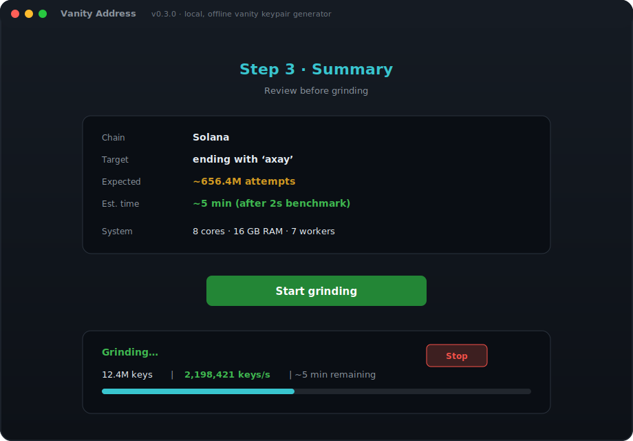

<div align="center">


# vanity-address

**Fast, local, multi-chain vanity address generator**

Generate multi-chain keypairs whose public address matches your desired prefix and/or suffix — entirely on your machine. No servers. No tracking. Keys never leave your device.

<br />

[](https://github.com/yudizaxay/vanity-address/actions/workflows/ci.yml)
[](https://github.com/yudizaxay/vanity-address/releases)
[](LICENSE)
[](https://github.com/yudizaxay/vanity-address/stargazers)
[](CONTRIBUTING.md)

<br />

[Features](#-features) ·
[Demo](#-demo) ·
[Install](#-install) ·
[Usage](#-usage) ·
[Architecture](#-architecture) ·
[Desktop App](#-desktop-app) ·
[Security](#-security) ·
[Contributing](#-contributing)

</div>

---

## ✨ Features

| Feature                     | Solana |   EVM    |
| --------------------------- | :----: | :------: |
| Prefix matching             |   ✅   |    ✅    |
| Suffix matching             |   ✅   |    ✅    |
| Case-insensitive mode       |   ✅   | ✅ (hex) |
| Exact case mode             |   ✅   |    —     |
| Parallel CPU grinding       |   ✅   |    ✅    |
| Live progress + ETA         |   ✅   |    ✅    |
| Multiple key export formats |   ✅   |    ✅    |
| 100% offline / local        |   ✅   |    ✅    |

**13+ chains** · **CLI + desktop app** · **MIT licensed** · **privacy-first** (keys never leave your machine)

---

## 🎬 Demo

<p align="center">
  
</p>

<p align="center">
  
</p>

<p align="center">
  <sub>CLI interactive menu or <strong>Vanity Address</strong> desktop app — chain wizard → live benchmark → grind → export keys</sub>
</p>

---

## 📦 Install

**[Download from GitHub Releases](https://github.com/yudizaxay/vanity-address/releases/latest)** — no Rust or Node.js required.

| I want… | My computer | File |
| ------- | ----------- | ---- |
| **Desktop app** | Mac M1–M4 | `VanityAddress-*-Mac-AppleSilicon-Desktop.dmg` |
| **CLI** | Mac M1–M4 | `VanityAddress-*-Mac-AppleSilicon-CLI.tar.gz` |
| **CLI** | Mac Intel | `VanityAddress-*-Mac-Intel-CLI.tar.gz` |
| **CLI** | Windows | `VanityAddress-*-Windows-CLI.zip` |
| **CLI** | Linux | `VanityAddress-*-Linux-CLI.tar.gz` |

**Quick start (Linux):**

```bash
curl -LO https://github.com/yudizaxay/vanity-address/releases/download/v0.3.0/VanityAddress-0.3.0-Linux-CLI.tar.gz
tar xzf VanityAddress-0.3.0-Linux-CLI.tar.gz
./vanity-address
```

> macOS may block unsigned apps — see [Install guide → Gatekeeper](docs/INSTALL.md#macos-gatekeeper-damaged-app).

📖 **Full guide:** [docs/INSTALL.md](docs/INSTALL.md) — per-platform steps, `.dmg` setup, checksums, Homebrew, crates.io, build from source

---

## 🚀 Usage

### Interactive mode (default)

```bash
vanity-address
```

Wizard flow: **chain → prefix/suffix → pattern → estimate → confirm → grind**.

### Direct mode

```bash
vanity-address --chain sol --suffix axay
vanity-address --chain evm --prefix dead --suffix beef -q
vanity-address --chain sol --suffix ax --json --no-benchmark --force
```

### Common flags

| Flag              | Description                              |
| ----------------- | ---------------------------------------- |
| `--chain <ID>`    | `sol`, `evm`, `btc`, `ltc`, `doge`, …   |
| `--prefix` / `--suffix` | Match start or end of address    |
| `--json`          | Machine-readable output (scripts)        |
| `--save`          | Append keys to `vanity-results.txt`      |
| `-q, --quiet`     | Minimal output for scripts               |

📖 **Full guide:** [docs/USAGE.md](docs/USAGE.md) — all chains, JSON schema, pattern rules, performance tips

---

## 🏗 Architecture

```text
┌───────────────────┐   ┌───────────────────┐
│  vanity-address    │   │    vanity-app      │
│      (CLI)         │   │  (Tauri desktop UI)│
├───────────────────┴───┴───────────────────┤
│                vanity-core lib              │
│  ┌────────┐ ┌─────┐ ┌──────────┐ ┌───────┐ │
│  │ Solana │ │ EVM │ │ Bitcoin… │ │  +10  │ │
│  │Grinder │ │Grind│ │ Grinders │ │ more  │ │
│  └────────┘ └─────┘ └──────────┘ └───────┘ │
│              ChainGrinder trait             │
└─────────────────────────────────────────────┘
```

New chain = one file + trait implementation in `vanity-core/src/chains/`. CLI and desktop UI are thin frontends over the same engine — no duplicated chain logic.

---

## 🖥 Desktop App

**Vanity Address** (`vanity-app/`) — native Tauri UI wired directly to `vanity-core`.

```text
Home → Chain → Pattern → Summary → Grind → Result
```

| Feature | Desktop |
| ------- | ------- |
| 13 chains, live ETA, stop mid-grind | ✅ |
| Impractical-pattern warning | ✅ |
| Masked keys + reveal / copy / save | ✅ |

**Install:** download the `.dmg` from [Releases](https://github.com/yudizaxay/vanity-address/releases/latest) — see [docs/INSTALL.md](docs/INSTALL.md#macos--desktop-app-dmg).

**Build from source:** `cd vanity-app && npm install && npm run tauri dev`

---

## 🔐 Security

> **⚠️ Read before generating keys**
>
> | Rule         | Detail                                                  |
> | ------------ | ------------------------------------------------------- |
> | Local only   | Keys are generated on **your machine**                  |
> | No network   | This tool **never connects to the internet**            |
> | Never share  | **Do not** share private keys with anyone               |
> | Verify first | Always double-check the address before sending funds    |
> | Open source  | Audit the code — trust, but verify                      |

Full policy: [SECURITY.md](SECURITY.md)

---

## 🤝 Contributing

Contributions welcome — new blockchains, bug fixes, features, docs, and tests.

Before opening a PR:

```bash
make check-ci
```

📖 **[CONTRIBUTING.md](CONTRIBUTING.md)** — add a chain, PR checklist, project structure

| Want to… | Start here |
|----------|------------|
| Add a blockchain | `vanity-core/src/chains/` + [contributing guide](CONTRIBUTING.md#adding-a-new-blockchain) |
| Fix a bug | Fork → branch → PR with repro steps |
| Propose a feature | [Open a feature request](https://github.com/yudizaxay/vanity-address/issues/new?template=feature_request.yml) |

---

## 📄 License

**[MIT License](LICENSE)** — free for personal and commercial use.

---

<div align="center">

**Built with 🦀 Rust** · Keys stay on your machine

<br />

[](https://github.com/yudizaxay/vanity-address)
[](https://github.com/yudizaxay/vanity-address/issues/new?template=bug_report.yml)
[](https://github.com/yudizaxay/vanity-address/issues/new?template=feature_request.yml)

<br />

<sub>If this project helped you, consider giving it a ⭐ on GitHub!</sub>

</div>
