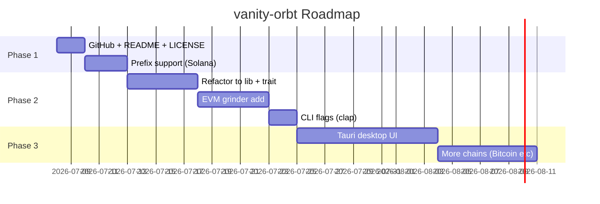

Bilkul sahi direction hai — yeh project open source ke liye strong base hai. Neeche practical plan hai, step by step.

---

## Meri honest opinion

**Haan, isko open source karna worth it hai**, lekin abhi jo code hai woh ek **solid MVP** hai, full product nahi. Pehle GitHub par clean release karo, phir architecture refactor karke multi-chain banao. UI baad mein — pehle **Rust core + CLI** perfect rahega.

**Kyun?**
- Vanity grinding CPU-heavy hai — Rust + rayon yahan sahi choice hai
- Private keys local rehni chahiye — terminal/desktop = zyada safe
- Web UI par keys generate karna trust issue create karta hai (log sochenge "mera key leak to nahi hoga?")
- Open source mein **CLI tools** zyada adopt hote hain jab README clear ho

---

## Step 1: GitHub repo banana (`vanity-orbt`)

GitHub par repo names usually **kebab-case** use karte hain:

| Option | Example |
|--------|---------|
| Recommended | `vanity-orbt` |
| Also fine | `vanity_orbt` |

**Pehle yeh files add karo** (abhi project mein git bhi nahi hai):

```
vanity-orbt/
├── .gitignore          # Rust standard (target/, .DS_Store)
├── LICENSE             # MIT recommended for OSS tools
├── README.md           # Install, usage, security warning
├── Cargo.toml
└── src/
    └── main.rs
```

**GitHub par repo banane ke steps:**

1. [github.com/new](https://github.com/new) par jao
2. Name: `vanity-orbt`
3. Description: `Fast multi-chain vanity address generator (Solana, EVM)`
4. Public, **without** README (local se push karoge)
5. Local terminal:

```bash
cd /Users/yudizsolutionsltd/Downloads/vanity_orbt
git init
git add Cargo.toml Cargo.lock src/ .gitignore LICENSE README.md
git commit -m "Initial release: Solana vanity address grinder"
git branch -M main
git remote add origin https://github.com/YOUR_USERNAME/vanity-orbt.git
git push -u origin main
```

**Important:** `target/` folder push mat karo — woh build artifacts hain.

---

## Step 2: UI ya Terminal?

### Phase 1 (abhi): Terminal CLI ✅

| Pros | Cons |
|------|------|
| Fast to ship | Non-technical users ko thoda hard |
| Keys 100% local | Less "wow" factor |
| Developers trust karte hain | |
| Already built hai | |

### Phase 2 (baad mein): Desktop UI via **Tauri**

Rust core same rakho, upar Tauri UI — best of both worlds:
- Keys still local
- Progress bar, chain selector, prefix/suffix input
- Cross-platform (Mac, Windows, Linux)

### Web UI — avoid for v1

Browser mein private key generate karna security red flag hai. Agar kabhi web chahiye, to **WASM in browser, fully client-side** + loud disclaimer — lekin trust kam milta hai.

**Recommendation:** CLI first → Tauri UI second.

---

## Step 3: Features — kya rakho, kya add karo

### V1 (open source launch) — jo abhi hai + thoda polish

| Feature | Status |
|---------|--------|
| Solana suffix grinding | ✅ Done |
| Case-insensitive / exact case | ✅ Done |
| Parallel grinding (rayon) | ✅ Done |
| Progress stats (keys/sec, ETA) | ✅ Done |
| Multiple export formats (hex, base58, JSON) | ✅ Done |
| **Prefix support** | ❌ Add karo |
| **EVM (Ethereum) support** | ❌ Add karo |
| README + security warnings | ❌ Add karo |
| CLI flags (`--suffix`, `--prefix`, `--chain`) | ❌ Add karo |

### V2 — multi-chain dynamic architecture

```
┌─────────────────────────────────────┐
│           CLI / Tauri UI            │
├─────────────────────────────────────┤
│         vanity-core (lib)           │
│  ┌─────────┐ ┌─────────┐ ┌───────┐ │
│  │ Solana  │ │   EVM   │ │ Future│ │
│  │ Grinder │ │ Grinder │ │ Chain │ │
│  └─────────┘ └─────────┘ └───────┘ │
│         Chain trait (plugin)        │
└─────────────────────────────────────┘
```

Har chain ek **trait** implement kare:

```rust
trait ChainGrinder {
    fn name(&self) -> &str;
    fn generate_keypair(&self) -> KeypairResult;
    fn format_address(&self, key: &KeypairResult) -> String;
    fn validate_pattern(&self, pattern: &str) -> Result<(), String>;
    fn matches(&self, address: &str, pattern: &Pattern) -> bool;
}
```

Nayi chain add karna = naya file + trait implement — core touch nahi karna.

### V3 — advanced features

- Prefix + suffix dono
- Regex pattern (power users)
- GPU acceleration (CUDA/OpenCL) — bahut complex, baad mein
- Bitcoin, Cosmos, etc.

---

## Step 4: Solana vs EVM — key differences

| | Solana | EVM (Ethereum) |
|--|--------|----------------|
| Address format | Base58 (no `0`, `O`, `I`, `l`) | Hex `0x` + `0-9`, `a-f` |
| Case | Case-insensitive option useful | Always lowercase hex |
| Key type | Ed25519 | secp256k1 |
| Library | `solana-sdk` | `ethers` / `k256` + `sha3` |
| Speed | ~similar on CPU | ~similar on CPU |

User ko chain select karna chahiye:

```bash
# Solana suffix
vanity-orbt --chain sol --suffix orbt

# EVM prefix + suffix
vanity-orbt --chain evm --prefix 0xDEAD --suffix BEEF

# Exact case (Solana only)
vanity-orbt --chain sol --suffix ORBT --exact
```

---

## Step 5: Suggested roadmap



---

## Step 6: README mein security warning (must have)

Open source vanity tools mein yeh **mandatory** hai:

> ⚠️ **Security**
> - Private keys are generated **locally on your machine**
> - Never share your private key with anyone
> - This tool does not connect to the internet
> - Always verify the address before sending funds
> - Use at your own risk

Yeh trust build karta hai — bina iske log hesitate karenge.

---

## Naming & branding suggestions

| Item | Suggestion |
|------|------------|
| Repo name | `vanity-orbt` |
| Tagline | "Fast, local, multi-chain vanity address generator" |
| Topics (GitHub) | `solana`, `ethereum`, `vanity-address`, `rust`, `crypto` |
| License | MIT |

---

## Final verdict

| Question | Answer |
|----------|--------|
| Open source karein? | **Haan** — good niche, real utility |
| Pehle GitHub? | **Haan** — current Solana code + README se start |
| UI ya terminal? | **Terminal first**, Tauri UI baad mein |
| Multi-chain? | **Haan** — trait-based design se start karo |
| Prefix + suffix? | **Haan** — users definitely chahenge |
| Dynamic chain add? | **Haan** — plugin/trait pattern best hai |

---

Agar chaho to next step mein main yeh kar sakta hoon:

1. `.gitignore`, `LICENSE`, `README.md` bana doon
2. Git init + first commit ready kar doon
3. Ya phir multi-chain refactor (`vanity-core` lib + EVM support) shuru kar doon

Batao kahan se start karna hai.